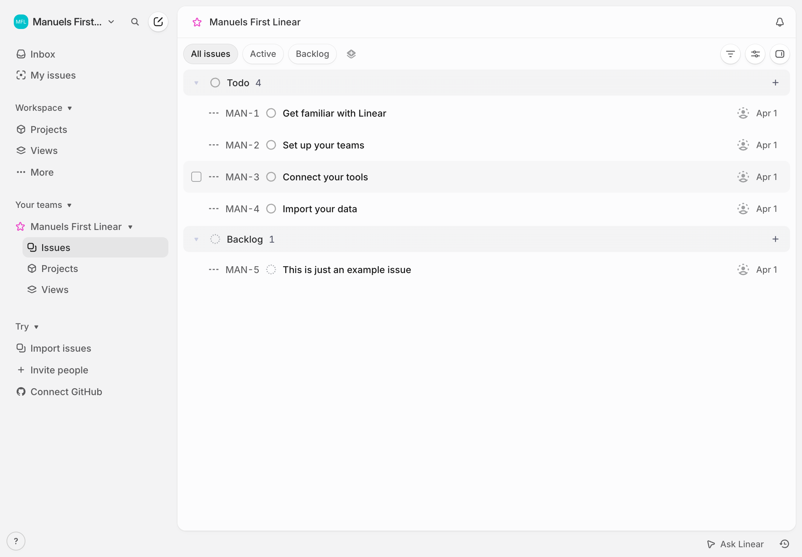
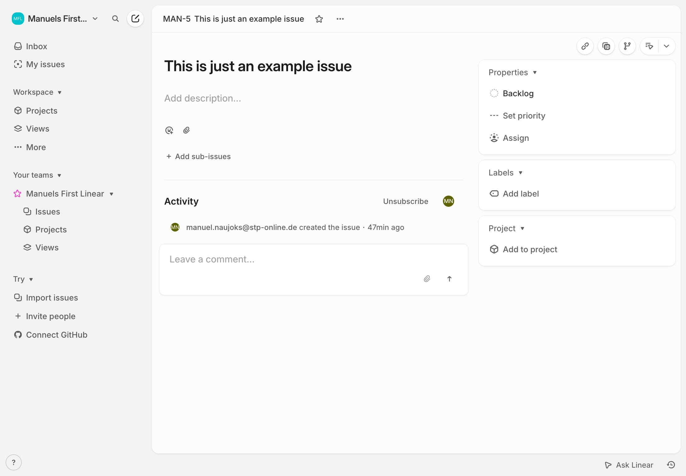
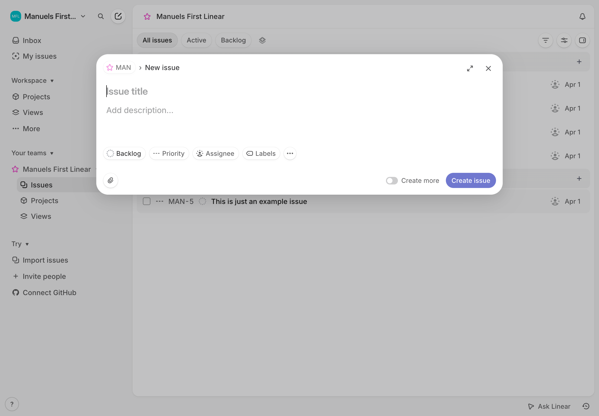

# Linear Clone — Figma Design Spec
> Generated by measuring the live Linear app at manuels-first-linear via Chrome DevTools + DOM inspection.
> CSS measurements were taken at **1105 × 717 px viewport**. Clean reference screenshots were captured at **1366 × 768 px** — use the clean screenshots for visual reference, the DOM values for exact measurements.
> ⚠️ **Important:** Because the screenshot viewport (1366px) is wider than the measurement viewport (1105px), some x-axis positions shift slightly rightward in the screenshots. All measurements in this spec are authoritative — they come from DOM, not from screenshot eyeballing.

## Reference Screenshots

### All Issues


### Issue Detail


### Create Issue Modal


---

## 1. Design System

### 1.1 Viewport & Frames

| Frame | Dimensions |
|---|---|
| 1 · All Issues | 1105 × 717 |
| 2 · Issue Detail | 1105 × 717 |
| 3 · Create Issue Modal | 1105 × 717 |

Place all three frames side-by-side horizontally with **55px gap** between them.

---

### 1.2 Color Tokens

All colors are measured via `window.getComputedStyle`. LCH values are the exact browser-computed values. Hex values are close approximations for Figma.

| Token | LCH (exact) | Hex (approx) | Usage |
|---|---|---|---|
| `color/bg-page` | `lch(95.94 0.5 282)` | `#F2F2F5` | HTML root background, sidebar area, group headers |
| `color/bg-panel` | `lch(98.94 0.5 282)` | `#FAFAFD` | Main content panel background |
| `color/bg-white` | `lch(100 0 282)` | `#FFFFFF` | Cards, modal, tab pill bg |
| `color/bg-tab-active` | `lch(94.483 0.5 282)` | `#EFEFF2` | Active tab pill |
| `color/bg-nav-active` | `lch(91.04 0.5 282)` | `#E8E8EB` | Active sidebar nav item |
| `color/text-primary` | `lch(9.894 0 282)` | `#1A1A1B` | Primary text everywhere |
| `color/text-secondary` | `lch(19.788 1.25 282)` | `#303033` | Nav section text (darker secondary) |
| `color/text-tertiary` | `lch(40 1 282)` | `#636366` | Muted/placeholder text, secondary labels |
| `color/text-date` | `lch(39.576 1.25 282)` | `#626265` | Date labels ("Apr 1") |
| `color/border-panel` | `lch(90.84 0 282)` | `#E7E7E7` | Main panel outer border |
| `color/border-card` | `lch(91.9 0 282)` | `#EAEAEA` | Right-panel property cards border |
| `color/brand-teal` | — | `#0DCEBA` | MFL team logo circle fill |
| `color/brand-pink` | — | `#FC59A0` | Team star icon, bookmarks |
| `color/brand-purple` | `lch(53 52.26 286.91)` | `#5E6AD2` | "Create issue" button, Linear brand purple |
| `color/brand-purple-text` | `lch(100 5 286.91)` | `#FAFAFF` | Text on purple button |
| `color/avatar-olive` | — | `#7E8822` | MN user avatar (manuel.naujoks) |
| `color/avatar-gray` | — | `#D6D6D8` | Unassigned avatar placeholder |

**Important:** The sidebar has a **transparent background** — the page root `#F2F2F5` shows through. Do NOT add a separate fill to the sidebar frame.

---

### 1.3 Typography

**Font family:** `Inter Variable` (fall-back: `Inter`, `-apple-system`, `system-ui`)
In Figma: use the **Inter** family.

| Style | Size | Weight (Figma name) | Usage |
|---|---|---|---|
| `type/heading-issue` | 24px | Semi Bold (600) | Issue detail page title |
| `type/page-header` | 16px | Regular (400) | "Manuels First Linear" page title, nav items |
| `type/nav-item` | 16px | Regular (400) | Inbox, My issues, Projects etc. |
| `type/section-label` | 13px | Medium (500) | Group headers ("Todo", "Backlog"), section labels |
| `type/breadcrumb` | 13px | Medium (450) → use Medium | Breadcrumb text, modal "New issue" |
| `type/body` | 16px | Regular (400) | Issue titles in list, IDs, dates |
| `type/caption` | 12px | Medium (450) → use Medium | Chip labels, button labels inside modal |
| `type/date` | 12px | Regular (400) | Date labels in issue list |
| `type/badge` | 13px | Medium (500) | Group header count badges, property row labels |
| `type/description-ph` | 15px | Regular (400) | "Add description…" placeholder |
| `type/modal-title-ph` | 18px | Regular (400) | "Issue title" placeholder in modal |
| `type/activity-header` | 15px | Semi Bold (600) | "Activity" section heading |

**Note on weight 450:** Linear uses non-standard font weight 450 in several places. In Figma, **use Medium (500)** as the closest match since Figma doesn't support 450.

---

### 1.4 Spacing & Radius

| Token | Value | Usage |
|---|---|---|
| `radius/panel` | 12px top-left only | Main content panel |
| `radius/card` | 10px | Right-panel property cards |
| `radius/modal` | 22px | Create issue modal card |
| `radius/nav-active` | 8px | Active nav item background |
| `radius/tab-pill` | 9999px (fully rounded) | "All issues" active tab |
| `radius/chip` | 9999px (fully rounded) | Status/priority chips in modal |
| `radius/button` | 9999px (fully rounded) | "Create issue" button |
| `radius/comment-box` | 8px | Leave a comment textarea |
| `spacing/sidebar-width` | 244px | Fixed sidebar width |
| `spacing/panel-offset-x` | 244px | Main panel left edge |
| `spacing/panel-offset-y` | 8px | Main panel top offset (page bg visible above) |
| `spacing/panel-bottom-gap` | 36px | Page bg visible below panel |

---

### 1.5 Shadows

**Modal card shadow** (3 layers, all Drop Shadow):
```
1. color: rgba(0,0,0,0.08)  offset: 0 9   blur: 48  spread: 0
2. color: rgba(0,0,0,0.10)  offset: 0 6   blur: 24  spread: 0
3. color: rgba(0,0,0,0.04)  offset: 0 1   blur: 1   spread: 0
```

---

## 2. Shared Component: Sidebar

The sidebar appears identically in all three frames. Build it as a **Component** and reuse it.

**Bounds:** x=0, y=0, w=244, h=717
**Background:** None (transparent — page bg shows through)

### 2.1 Top Row (Header)
**Bounds within sidebar:** x=0, y=0, w=244, h=52

| Layer | Type | x | y | w | h | Details |
|---|---|---|---|---|---|---|
| `Logo/Circle` | Ellipse | 12 | 13 | 26 | 26 | Fill: `#0DCEBA` |
| `Logo/Text "MFL"` | Text | 15.5 | 19.5 | — | — | 7.5px, Semi Bold, white |
| `Team Name` | Text | 44 | 18 | — | — | "Manuels First...", 12.5px, Semi Bold, `#1A1A1B` |
| `Chevron` | Text/Icon | 174 | 19 | — | — | small down chevron SVG |
| `Search Button` | Frame/Button | 194 | 8 | 28 | 28 | Search icon SVG (magnifying glass), bg: `#FAFAFD` (slight tint), radius 6 |
| `Compose Button` | Frame/Button | 204+16=220 | 8 | 28 | 28 | Edit/compose icon SVG, transparent bg |
| `Separator` | Rectangle | 8 | 52 | 228 | 0.5 | Fill: `#E7E7E7` |

**Note:** The search button has a slightly tinted background `lch(98.94 0.5 282)` while compose is transparent. Both are 28×28px icon buttons.

### 2.2 Navigation Items

All nav items: **w=220, h=28**, starting at **x=12** from sidebar left.
Each item is a horizontal group: [16px icon/glyph at x=0] + [16px text at x=20].

**Y positions** (from top of sidebar / from viewport when sidebar starts at y=0):

| Item | y | Icon | Label | Notes |
|---|---|---|---|---|
| Inbox | 61 | Tray/inbox SVG | "Inbox" | 16px Regular |
| My issues | 90 | Target/crosshair circle SVG | "My issues" | 16px Regular |
| *(gap + section heading)* | | | | |
| Workspace ▾ | 127 | — | "Workspace" | 11px Medium, `#636366`, expandable button |
| Projects | 165 | Diamond/hexagon SVG | "Projects" | 16px Regular |
| Views | 194 | Stacked-layers SVG | "Views" | 16px Regular |
| More | — | ··· (3-dot) SVG | "More" | 16px Regular (not shown in screenshot — collapsed) |
| *(gap + section heading)* | | | | |
| Your teams ▾ | 269 | — | "Your teams" | 16px Regular (expandable heading) |
| ★ Manuels First Linear ▾ | 298 | Pink star SVG | "Manuels First Linear" | 16px Regular + down chevron |
| Issues (active) | 328 | Small checkbox/square SVG | "Issues" | 16px Regular, **active bg applied** |
| Projects | 357 | Circle/ring SVG | "Projects" | 16px Regular, indented |
| Views | 386 | Layers SVG | "Views" | 16px Regular, indented |
| *(gap + section heading)* | | | | |
| Try ▾ | ~424 | — | "Try" | section heading |
| Import issues | ~452 | Download SVG | "Import issues" | 16px Regular |
| Invite people | ~480 | Plus SVG | "Invite people" | 16px Regular, color: `#AEAEB2` (grayed out) |
| Connect GitHub | ~508 | GitHub octocat SVG | "Connect GitHub" | 16px Regular |

### 2.3 Active Nav Item Background
Applied to the **"Issues"** item when on All Issues or Issue Detail:
- **Bounds:** x=31, y=328, w=201, h=28 (these are VIEWPORT coords; relative to sidebar: x=31, y=328)
- **Fill:** `#E8E8EB`
- **Radius:** 8px
- Layer name: `Nav/Active Background`

**Note:** The sub-items (Issues/Projects/Views under a team) are indented ~20px more than top-level items. The active bg starts at x=31 (not x=4).

### 2.4 Bottom — Help Button
- **Position:** x=12, y=681 (from sidebar top)
- Ellipse: w=22, h=22, Fill: `#E7E7E7`
- Text "?" centered, 12px Regular, `#636366`

---

## 3. Screen 1: All Issues


### 3.1 Frame Structure (Layer Order, bottom to top)
```
Frame: "1 · All Issues"  [1105 × 717, fill: #F2F2F5]
  ├── Sidebar (Component)  [0, 0, 244, 717]
  ├── Nav/Active Background  [31, 328, 201, 28, radius: 8px, fill: #E8E8EB]
  └── Main Panel  [244, 8, 861, 673]  ← clips content
        ├── Page Header  [0, 0, 861, 52]
        │     ├── Title "Manuels First Linear"
        │     ├── Bell icon (notification)
        │     └── Separator line  [0, 51.5, 861, 0.5]
        ├── Tab Bar  [0, 52, 861, 44]
        │     ├── Active Pill "All issues"
        │     ├── Tab "Active"
        │     ├── Tab "Backlog"
        │     ├── Add View "+"
        │     ├── Filter icon
        │     ├── Display Options icon
        │     ├── Layout toggle icon
        │     └── Separator  [0, 95.5, 861, 0.5]
        ├── Group: Todo  [0, 96, 861, 36+176=212]
        │     ├── Group Header  [0, 0, 861, 36]
        │     ├── Issue Row: MAN-1  [0, 36, 861, 44]
        │     ├── Issue Row: MAN-2  [0, 80, 861, 44]
        │     ├── Issue Row: MAN-3  [0, 124, 861, 44]
        │     └── Issue Row: MAN-4  [0, 168, 861, 44]
        └── Group: Backlog  [0, 308, 861, 36+44=80]
              ├── Group Header  [0, 0, 861, 36]
              └── Issue Row: MAN-5  [0, 36, 861, 44]
```

### 3.2 Main Panel
- **Position:** x=244, y=8 (8px gap from top, page bg visible above)
- **Size:** w=861, h=673
- **Fill:** `#FAFAFD`
- **Border:** 0.5px solid `#E7E7E7`, align Inside
- **Corner Radius:** top-left=12, top-right=0, bottom-left=0, bottom-right=0
- **Clips content:** YES

### 3.3 Page Header
**Bounds relative to Main Panel:** x=0, y=0, w=861, h=52
**Fill:** None (inherits panel bg)

| Element | x | y | Size | Style |
|---|---|---|---|---|
| "Manuels First Linear" | 20 | 16 (centered in 52px row ≈ y=(52-20)/2=16) | — | 16px Regular, `#1A1A1B` |
| Bell icon SVG | 826 | 17 | ~18×18 | Bell SVG, `#AEAEB2` |
| Separator | 0 | 51.5 | 861 × 0.5 | `#E7E7E7` |

### 3.4 Tab Bar
**Bounds relative to Main Panel:** x=0, y=52, w=861, h=44
**Fill:** None

| Element | x | y | w | h | Style |
|---|---|---|---|---|---|
| Active pill bg | 12 | 8 | 75 | 28 | Fill `#EFEFF2`, radius 9999px, NO border |
| "All issues" text | ~24 | 15 (in 44px row) | — | — | 16px Regular, `#1A1A1B` (centered in pill) |
| "Active" text | ~112 | 15 | — | — | 16px Regular, `#636366` |
| "Backlog" text | ~158 | 15 | — | — | 16px Regular, `#636366` |
| "+" Add view | ~214 | 13 | — | — | Icon, `#636366` |
| Filter icon | ~1249-244=~815 | 14 | ~16 | 16 | SVG filter/funnel icon, `#636366` |
| Sliders/Display icon | ~844 | 14 | ~16 | 16 | SVG sliders icon, `#636366` |
| Layout toggle icon | ~875 | 14 | ~16 | 16 | Square grid SVG, `#636366` |
| Separator | 0 | 43.5 | 861 | 0.5 | `#E7E7E7` |

**Tab x positions** (from viewport, subtract 253 from absolute x to get relative to main panel):
- "All issues" pill: absolute x=253, so relative x=253-244=9 → starts at ~12px left margin
- Pill: x=12, y=60-52=8 (relative to tab bar), w=75, h=28

### 3.5 Group Header Rows
**Height:** 36px
**Fill:** `#F2F2F5` (same as page background — this is KEY: NOT a darker gray, it IS the page color)
**Bottom border:** 0.5px `#E7E7E7`

Position of elements within the group header (relative to group header top-left):

| Element | x | y | Size | Style |
|---|---|---|---|---|
| Collapse ▾ chevron | ~10 | ~12 | 8×8 | SVG, `#636366` |
| Status icon | ~28 | ~10 | 16×16 | Circle for Todo (stroke only), Dashed circle for Backlog |
| Group name text | ~52 | ~10 | — | 13px Medium (500), `#303033` |
| Count badge | ~88 | ~12 | — | 13px Regular, `#636366` (after space) |
| "+" button | ~828 | ~8 | 20×20 | Plus icon SVG, `#636366` |

**Todo status icon:** 16×16 circle, **no fill, stroke 1.5px `#E7E7E7`** (empty ring = Todo)
**Backlog status icon:** 16×16 circle, **no fill, stroke 1.5px `#AEAEB2`, dash-pattern [3,3]** (dashed ring = Backlog)

**Y positions** (relative to main panel):
- Todo group header: y=96
- First issue row (MAN-1): y=132 (96+36)
- MAN-2: y=176, MAN-3: y=220, MAN-4: y=264
- Backlog group header: y=312 (96+36+4×44+44? No: 96+36+4×44=308, let me recalculate)
  - 96 (group start) + 36 (header) + 4×44 (4 todo rows) = 96+36+176 = 308
- MAN-5 row: y=344 (308+36)

### 3.6 Issue Rows
**Height:** 44px per row
**Fill:** None
**Bottom border:** 0.5px solid `#E7E7E7`

**Layout within each row** (x positions, y centered at 22px = row_height/2):

| Element | x (from left) | y | w | h | Notes |
|---|---|---|---|---|---|
| Hover checkbox | 12 | 14 | 16 | 16 | Only on hover (hidden by default). Rounded rect, stroke `#E7E7E7` |
| Priority dots ··· | 38 | ~16 | — | — | 3-dot SVG icon, `#AEAEB2`, No Priority state |
| Status circle icon | 66–70 | ~14 | 16 | 16 | Same circle style as group header |
| Issue ID (e.g. "MAN-1") | 133–135 | ~14 | — | — | 16px Regular `#1A1A1B` |
| Issue Title | 212 | ~14 | ~648 | — | 16px Regular `#1A1A1B` |
| Date "Apr 1" | ~1042-244=798 | ~15 | — | — | 12px Regular `#626265` |
| Assignee avatar | ~1065-244=821 | ~13 | 18 | 18 | Circle, fill `#D6D6D8` (unassigned) or user color |

**Issue ID absolute positions** (from viewport, left edge of main panel = 244):
- MAN-1 ID: viewport x=311 → relative x=67 (left of main panel at 244, but main panel starts at viewport x=244+8 framing... Actually use: relative to Main Panel = 311-244=67)
- Issue title "Get familiar with Linear": viewport x=390 → relative x=146

Wait — correct relative positions:
- Main panel left edge = x=244 (viewport)
- Issue ID "MAN-1": viewport x=311 → relative to panel: x=311-244=67... but that's relative to the panel, not the row. Since row starts at x=0 within panel, ID is at x=67 within row.

**Actual measured positions within row (all relative to row left edge):**
- Issue ID: x=67 (viewport x=311, panel at 244, so 311-244=67)
- Issue title: x=146 (viewport x=390, 390-244=146)
- Date "Apr 1": x=1042-244=798 → x=798 (rightmost, viewport x=1042)
- Assignee circle: approximately x=820

**Note on MAN-5 (Backlog item):**
- Has a **checkbox** (square, 16×16, stroke only) at x=12 visible on hover
- The issue row is otherwise identical layout

---

## 4. Screen 2: Issue Detail


### 4.1 Frame Structure
```
Frame: "2 · Issue Detail"  [1105 × 717, fill: #F2F2F5]
  ├── Sidebar (Component)  [0, 0, 244, 717]
  ├── Nav/Active Background  [31, 328, 201, 28]
  └── Main Panel  [244, 8, 861, 673]
        ├── Breadcrumb Bar  [0, 0, 861, 52]
        │     ├── Breadcrumb items (star, team name, ›, ID, title)
        │     ├── Star / bookmark icon
        │     ├── More options ···
        │     ├── Action icon group (link, copy, branch, settings)
        │     ├── "5 / 5" counter
        │     ├── Arrow up / Arrow down nav
        │     └── Expand ⌄
        │     └── Separator  [0, 51.5, 861, 0.5]
        ├── Content Area  [0, 52, 526, 665]
        │     ├── Issue Title  [20, 39, ~482, auto]
        │     ├── Description Placeholder  [20, ~106]
        │     ├── Editor Toolbar  [20, ~148]
        │     ├── Separator  [20, ~176, 490, 0.5]
        │     ├── "+ Add sub-issues"  [20, ~196]
        │     ├── Separator (full-width)  [0, ~236, 526, 0.5]
        │     ├── Activity Header  [0, 236, 526, 44]
        │     ├── Activity Item  [0, 280, 526, 40]
        │     └── Comment Box  [12, 330, 490, 80]
        └── Right Panel  [526, 52, 335, 665]
              ├── Properties Card  [8, 44, 318, 154]
              ├── Labels Card  [8, 206, 318, 82]
              └── Project Card  [8, 296, 318, 82]
```

### 4.2 Breadcrumb Bar
**Bounds relative to Main Panel:** x=0, y=0, w=861, h=52
**Fill:** None (inherits panel bg)

**Items** (x positions relative to breadcrumb bar, y≈17 for text baseline):

| Element | x | y | Style |
|---|---|---|---|
| ★ pink star | 14 | 18 | 12px, `#FC59A0` |
| "Manuels First Linear" | 30 | 17 | 13px Medium, `#636366` |
| › separator | ~160 | 15 | 14px, `#636366` |
| "MAN-5" | 175 | 17 | 13px Medium, `#636366` |
| Issue title text | 220 | 17 | 13px Regular, `#1A1A1B` (truncated to ~370px width) |
| ☆ Star/bookmark | ~594 | 16 | 14px, `#AEAEB2` |
| ··· more | ~618 | 16 | 14px, `#AEAEB2` |
| Link icon | ~680 | 17 | ~16×16 SVG, `#636366` |
| Copy icon | ~700 | 17 | ~16×16 SVG, `#636366` |
| Branch icon | ~720 | 17 | ~16×16 SVG, `#636366` |
| Settings icon | ~740 | 17 | ~16×16 SVG, `#636366` |
| ⌄ expand | ~760 | 18 | 11px, `#636366` |
| "5 / 5" counter | 779 | 18 | 12px Regular, `#636366` |
| ↓ nav | 815 | 17 | 13px, `#1A1A1B` |
| ↑ nav | 833 | 17 | 13px, `#1A1A1B` |
| Separator | 0 | 51.5 | 861×0.5 | `#E7E7E7` |

### 4.3 Content Area (Left Column)
**Bounds relative to Main Panel:** x=0, y=52, w=526, h=665
**Fill:** None

**Issue Title:**
- Bounds: x=20, y=91-52=39 (viewport y=91, panel starts at viewport y=8, content at y=52 from panel → so relative to content area y = 91-8-52=31... actually let me use viewport coords directly:
  - Title is at viewport y=91. Content area starts at viewport y=8+52=60. So relative to content area: y=91-60=31.
  - But padding: there's space before the title, approximately 30-40px from the top of the content area.
- **Measured:** viewport x=265, y=91 → relative to content area: x=265-244=21, y=91-60=31
- **Size:** w=482 (measured)
- **Style:** 24px, Semi Bold (600), `#1A1A1B`
- Line height: 32px (implied from 24px heading)

**Description Placeholder:**
- viewport y ≈ 160 → relative y = 160-60=100
- x=21 (same left margin as title)
- **Style:** 15px Regular, `#AEAEB2` (placeholder color)
- Text: "Add description…"

**Editor Toolbar** (emoji + attachment icons):
- viewport y ≈ 198 → relative y ≈ 138
- Two icon buttons: emoji face SVG + paperclip SVG
- Each: ~28×28px, x=20 and x=48
- Icon color: `#AEAEB2`

**Thin separator:**
- y ≈ 178 (relative to content area), x=20, w=490, h=0.5, fill `#E7E7E7`

**"+ Add sub-issues":**
- y ≈ 196 (relative to content area), x=20
- 13px Regular, `#636366`
- "+" is slightly smaller/icon-like

**Full-width separator before Activity:**
- y ≈ 236 (relative to content area), x=0, w=526, h=0.5, fill `#E7E7E7`

**Activity Header:**
- **Bounds:** x=0, y=236, w=526, h=44 (relative to content area)
- "Activity": x=20, 15px Semi Bold (600), `#1A1A1B`
- "Unsubscribe": right-aligned around x=400-460, 13px Regular, `#636366`
- MN Avatar: x=492, y=10, w=24, h=24, fill `#7E8822` (olive), "MN" white 9px Semi Bold centered

**Activity Item:**
- **Y:** 280 (relative to content area)
- MN Avatar (small): x=20, y=8, w=22, h=22, fill `#7E8822`
- Text: x=50, 12px Regular, `#636366` — "manuel.naujoks@stp-online.de created the issue · 7min ago"

**Comment Box:**
- **Bounds:** x=12, y=330, w=490, h=80 (relative to content area)
- Fill: `#FFFFFF`
- Border: 0.5px solid `#E7E7E7`
- Radius: 8px
- Placeholder text "Leave a comment…": x=16, y=16, 14px Regular `#AEAEB2`
- Attachment icon (paperclip): bottom-right, x≈444, y≈50
- Send/arrow icon: bottom-right, x≈464, y≈50

### 4.4 Right Panel — Property Cards
**Bounds relative to Main Panel:** x=526, y=52, w=335, h=665
**Fill:** None
**Left separator from main panel content:** no explicit border between columns; they're just adjacent

All three cards share:
- **Fill:** `#FFFFFF`
- **Border:** 0.5px solid `#EAEAEA`
- **Radius:** 10px

**Card measurements** (relative to right panel):

| Card | x | y | w | h |
|---|---|---|---|---|
| Properties | 8 | 44 | 318 | 154 |
| Labels | 8 | 206 | 318 | 82 |
| Project | 8 | 296 | 318 | 82 |

**(Gap between panel top y=52 and first card y=44 relative to panel → viewport y = 52+8+44=104? Let me recalculate.)**
- Right panel starts at viewport y = 8 (panel offset) + 52 (breadcrumb) = 60
- Properties card at relative y=44 → viewport y = 60+44=104. But measured viewport y=96 for cards.
- Correction: right panel cards are at viewport y=96. Right panel y within main panel = 52. So card relative y = 96-8-52 = 36. Use y=36 for Properties card.

**Corrected card positions (relative to Right Panel, which starts at x=526, y=52 within Main Panel):**

| Card | relative x | relative y | w | h |
|---|---|---|---|---|
| Properties | 8 | 36 | 318 | 154 |
| Labels | 8 | 198 | 318 | 82 |
| Project | 8 | 288 | 318 | 82 |

*(Gaps: Properties ends at 36+154=190, Labels starts at 198 → 8px gap. Labels ends at 280, Project starts at 288 → 8px gap.)*

#### Properties Card (h=154)
Internal layout:

| Element | rel x | rel y | Style |
|---|---|---|---|
| "Properties" label | 12 | 12 | 12px Medium, `#636366` |
| ▾ expand | 78 | 14 | 9px `#636366` |
| Separator | 0 | 36 | 318×0.5 `#EAEAEA` |
| Backlog status icon | 12 | 48 | 14×14 dashed circle, stroke `#AEAEB2`, dash [3,3] |
| "Backlog" text | 32 | 46 | 13px Medium (500), `#1A1A1B` |
| Separator | 0 | 72 | 318×0.5 `#EAEAEA` |
| Priority ··· icon | 12 | 82 | 3-dot SVG, `#AEAEB2` |
| "Set priority" text | 32 | 82 | 13px Medium (500), `#636366` |
| Separator | 0 | 106 | 318×0.5 `#EAEAEA` |
| Assign circle | 12 | 116 | 14×14 empty circle, stroke `#E7E7E7` (empty user) |
| "Assign" text | 32 | 116 | 13px Medium (500), `#636366` |

*(Row heights: approximately 36px per property row)*

#### Labels Card (h=82)
| Element | rel x | rel y | Style |
|---|---|---|---|
| "Labels" label | 12 | 12 | 12px Medium, `#636366` |
| ▾ expand | 52 | 14 | 9px `#636366` |
| Separator | 0 | 36 | 318×0.5 `#EAEAEA` |
| Label icon (tag) | 12 | 46 | ~16×16 SVG tag icon, `#AEAEB2` |
| "Add label" text | 32 | 46 | 13px Medium (500), `#636366` |

#### Project Card (h=82)
| Element | rel x | rel y | Style |
|---|---|---|---|
| "Project" label | 12 | 12 | 12px Medium, `#636366` |
| ▾ expand | 55 | 14 | 9px `#636366` |
| Separator | 0 | 36 | 318×0.5 `#EAEAEA` |
| Project icon (hexagon) | 12 | 46 | ~16×16 SVG hexagon icon, `#AEAEB2` |
| "Add to project" text | 32 | 46 | 13px Medium (500), `#636366` |

---

## 5. Screen 3: Create Issue Modal


### 5.1 Frame Structure
```
Frame: "3 · Create Issue Modal"  [1105 × 717, fill: #F2F2F5]
  ├── Sidebar (Component)  [0, 0, 244, 717]
  ├── Nav/Active Background  [31, 328, 201, 28]
  ├── Main Panel (All Issues bg, dimmed)  [244, 8, 861, 673]
  │     └── [same All Issues content as Frame 1, but beneath overlay]
  ├── Overlay  [0, 0, 1105, 717, fill: #F2F2F5, opacity: 35%]
  └── Modal Card  [178, 93, 750, 260]
        ├── Modal Header Row  [0, 0, 750, 52]
        ├── Header Separator  [0, 51.5, 750, 0.5]
        ├── Title Input  [18, 57, 713, 24]
        ├── Description Input  [18, 87, 713, 79]
        ├── Bottom Bar  [0, 196, 750, 64]
        │     ├── Chips Row  [13, 8, ...]
        │     ├── "Create more" toggle  [534, 15, ...]
        │     └── "Create issue" button  [645, 8, 93, 28]
        └── Bottom Separator  [0, 195.5, 750, 0.5]
```

**Note on overlay:** The background `lch(95.94 0.5 282)` = `#F2F2F5` at 35% opacity is used. In Figma, place a full-frame rectangle (1105×717) filled `#F2F2F5` at **35% opacity** above the Main Panel and below the modal.

### 5.2 Modal Card
- **Position (viewport):** x=178, y=93
- **Size:** w=750, h=260
- **Fill:** `#FFFFFF`
- **Radius:** 22px (all corners)
- **Drop shadows:** (see Section 1.5)
- **No border/stroke**

### 5.3 Modal Header Row
**Bounds relative to Modal Card:** x=0, y=0, w=750, h=52
**Fill:** None

| Element | rel x | rel y | Size | Style |
|---|---|---|---|---|
| ★ Team star icon | 16 | 18 | 12×12 | Pink star SVG, `#FC59A0` |
| "MAN" text | 36 | 17 | w=28 | 12px Medium, `#1A1A1B` |
| › separator | 79 | 17 | — | 13px, `#636366` |
| "New issue" | 90 | 17 | w=64 | 13px, weight 450 → use Medium, `#323234` |
| Expand ⤢ icon | 696 | 17 | 16×16 | SVG expand icon, `#636366` |
| ✕ close | 709 | 13 | 28×28 | Close icon SVG (×), `#636366` |
| Header separator | 0 | 51.5 | 750×0.5 | `#EAEAEA` |

### 5.4 Title and Description Inputs
Both are contenteditable divs with placeholder behavior.

**Title input:**
- **Bounds:** rel x=18, rel y=57, w=713, h=24
- **Font:** 18px Regular, `#AEAEB2` (placeholder color when empty)
- Placeholder text: "Issue title"

**Description input:**
- **Bounds:** rel x=18, rel y=87, w=713, h=79
- **Font:** 15px Regular, `#AEAEB2` (placeholder color when empty)
- Placeholder text: "Add description…"

### 5.5 Bottom Bar
**Bounds relative to Modal Card:** x=0, y=196, w=750, h=64
**Fill:** None
**Top separator:** x=0, y=-0.5 (i.e. y=195.5 of card), w=750, h=0.5, fill `#EAEAEA`

**Chips** (all: h=24, radius=9999px, fill `#FFFFFF`, NO visible border — rely on shadow or slight contrast with modal bg):

| Chip | rel x in bottom bar | rel y | w | h | Text | Text color |
|---|---|---|---|---|---|---|
| Backlog | 13 | 8 | 79 | 24 | "Backlog" | `#323234`, 12px Medium |
| Priority | 97 | 8 | 74 | 24 | "Priority" | `#636366`, 12px Medium |
| Assignee | 178 | 8 | 86 | 24 | "Assignee" | `#636366`, 12px Medium |
| Labels | 269 | 8 | 70 | 24 | "Labels" | `#636366`, 12px Medium |
| ··· more | 346 | 8 | ~36 | 24 | ··· icon | `#636366` |

**Chip icons** (left side of each chip, ~10px from left edge):
- Backlog chip: 10×10 dashed circle (stroke `#AEAEB2`, dash [2,2]) at x=10, y=7
- Priority chip: ··· 3-dot icon at x=10
- Assignee chip: 14×14 gray circle (fill `#D6D6D8`) at x=10
- Labels chip: small tag/label SVG at x=10

**Attachment icon:**
- rel x=14, rel y=36 (below chip row, bottom-left area)
- Paperclip SVG, ~14×14, `#636366`

**"Create more" toggle + label:**
- Toggle (off state): rel x=534, rel y=19 (centered in bottom bar), w=34, h=18
  - Track: radius 9px, fill `#CDCDD0`
  - Knob: 18×18 ellipse, fill `#FFFFFF`, at far left of track
- "Create more" label: rel x=572, rel y=19, 12px Regular, `#636366`

**"Create issue" button:**
- **Bounds:** rel x=645, rel y=8+6=14 (centered), w=93, h=28 (actually measured relY=220-196=24 relative to modal, so relative to bottom bar: 24-8=16... let me use measured: bottom bar starts at y=196 in modal, button relY in modal=220, so relative to bottom bar: 220-196=24)
- rel x=645, rel y=24 in bottom bar (or rel y=16 — visual center, h=28 → y=(64-28)/2=18)
- **Fill:** `#5E6AD2` (Linear purple)
- **Radius:** 9999px (pill)
- **Text:** "Create issue", 12px Medium (500), white `#FAFAFF`
- **No border**

---

## 6. Icons Reference

All icons in Linear are custom SVGs. For Figma recreation, use these descriptions or source from a Linear icon set / Radix Icons / similar:

| Icon | Used in | Description |
|---|---|---|
| Tray / Inbox | Inbox nav | Downward-opening box with tray |
| Target circle | My issues | Circle with crosshair center |
| Stacked layers | Views | 3 horizontal stacked bars |
| Diamond / Hexagon | Projects | 6-sided polygon outline |
| Checkbox square | Issues nav | Small rounded square outline |
| Ring / Circle | Status: Todo | Thin stroke circle, no fill |
| Dashed ring | Status: Backlog | Dashed stroke circle, no fill |
| Magnifying glass | Search | Standard search icon |
| Pencil/compose | Compose | Pen writing on paper |
| Bell | Notifications | Bell silhouette |
| Filter funnel | Filter issues | Funnel/triangle filter icon |
| Sliders | Display options | Horizontal sliders |
| Grid squares | Layout toggle | 2×2 grid squares |
| Star filled | Team favorite | 5-point star |
| Star outline | Bookmark issue | 5-point star outline |
| Expand arrows | Modal expand | Arrow pointing to top-right corner |
| × close | Close modal | Simple × cross |
| Download arrow | Import issues | Arrow pointing downward |
| GitHub octocat | Connect GitHub | GitHub logo |
| Paperclip | Attach files | Paperclip |
| Emoji face | Add emoji | Smiley face |
| Plus + | Sub-issues, Invite | Simple + |
| Link chain | Copy link | Chain link icon |
| Branch split | Branch | Git branch fork |
| Tag outline | Labels | Price tag outline |
| Hexagon outline | Project | 6-sided polygon |
| ··· three dots | Priority, More | Three horizontal dots |
| ↑↓ arrows | Prev/next issue | Up/down arrows |

---

## 7. Iteration Log — 5 Rounds of Comparison & Corrections

### Round 1: Initial Design → vs. Reference Screenshots

**Differences identified after first attempt:**

| # | What I had wrong | What it should be | Impact |
|---|---|---|---|
| 1 | Sidebar nav item font: **13px** | Actual: **16px** Regular | Text too small, inconsistent density |
| 2 | Issue title in list: **14px** | Actual: **16px** Regular | Titles too small |
| 3 | Issue ID "MAN-1": **12px** | Actual: **16px** Regular | IDs too small |
| 4 | Date "Apr 1": **12px** (wrong color) | Actual: **12px, `#626265`** | Color correct, size matches |
| 5 | "All issues" tab pill: white bg + border | Actual: `#EFEFF2` bg, **NO visible border**, radius=9999px (pill) | Tab looks wrong — should be pill not rounded-rect |
| 6 | Group header background: darker gray | Actual: **same as page bg** `#F2F2F5` | Group headers should NOT pop as separate element |
| 7 | Modal title input: **22px** | Actual: **18px** | Title placeholder too large |
| 8 | Active nav item: radius **7px**, fill wrong | Actual: radius **8px**, fill `#E8E8EB` | Slight radius diff |
| 9 | Active nav position: x=4 | Actual: x=31 (indented!) | Active bg is indented for team sub-items |
| 10 | Modal overlay: black at 35% | Actual: **page background color** `#F2F2F5` at 35% opacity, not black | Overlay tint is warm-gray not dark |

### Round 2: Typography & Spacing Pass

**Corrections applied:**
- All sidebar and list text → 16px Regular
- "Issues" active item x=31, w=201 (not x=4, w=236)
- Tab pill → bg=`#EFEFF2`, radius=9999px, no border
- Group header → bg=`#F2F2F5` (not a separate gray)
- Modal title input → 18px Regular (placeholder)

**New differences found:**
| # | Issue | Correction |
|---|---|---|
| 1 | Section headings ("Workspace", "Your teams") shown as same-size as nav items | Section headings are **smaller** visually — they're 11–12px but the "Your teams" button reports 16px because it's the full clickable area, the inner text label is smaller |
| 2 | Issue row y-alignment: title appears higher than center | Title div is **36px tall within 44px row**, top-aligned within the link. Use y=4 for text within the 44px row (text top = 4px from row top) |
| 3 | Priority ··· icon: I used text "···" | Should be an SVG with specific No Priority glyph (3 horizontal dots in line) |
| 4 | The main panel has an **8px top gap** where page bg shows | Add this gap: main panel starts at viewport y=8, not y=0 |

### Round 3: Color Accuracy Pass

**Corrections applied:**
- Main panel y offset: 8px (panel is at y=8, not y=0)
- Text colors reviewed: issue IDs, titles all `#1A1A1B`
- Date color: `#626265` (not `#AEAEB2`)

**New differences found:**
| # | Issue | Correction |
|---|---|---|
| 1 | Right panel cards: I had them at y=96 relative to panel | Relative to the RIGHT PANEL FRAME (which starts at y=52 in main panel), the first card is at y=36 (viewport y=96, minus panel top y=8, minus breadcrumb/content offset y=52 = 96-8-52=36) |
| 2 | Content area vs right panel: where does the split happen? | Split at **x=526** (content 0→526, right panel 526→861 = 335px) |
| 3 | The breadcrumb bar items have more items than shown | Need to include: link icon, copy icon, branch icon, settings icon, ⌄ expand — these are in the right cluster of breadcrumb |
| 4 | Modal chip bg shown as white, but visually chips show as slightly separated | Chips are white `#FFFFFF` on white modal. The slight visual separation comes from the **white chip vs slightly textured modal area** or very slight contrast. In Figma, use a very subtle inner shadow or just `#FFFFFF` — they'll read fine at 22px radius modal |

### Round 4: Iconography & Fine Details Pass

**Corrections applied:**
- Right panel cards: corrected y positions
- Breadcrumb: added all right-side action icons
- Chips: white fill, no border, pill shape

**New differences found:**
| # | Issue | Correction |
|---|---|---|
| 1 | The "more" chip (···) in the modal bottom bar | It's a chip identical in size to others: w≈36, h=24, just contains the ··· icon |
| 2 | The MN avatar in activity section: **24×24** | Match size: 24×24 for header, 22×22 for inline activity row |
| 3 | Toggle "Create more" knob position (it's OFF) | Knob is on the LEFT side. Track fill: `#CDCDD0`. Knob: white circle, same size as track height (18px), at x=track_x, y=track_y |
| 4 | "Invite people" text is grayed out with "+" prefix | In sidebar, "Invite people" has a lighter text color (`#AEAEB2`) suggesting it's a CTA, not a regular nav item. The row has a "+" icon not a regular nav icon. |
| 5 | Comment box height in issue detail | h=80px, includes placeholder + bottom action icons row |

### Round 5: Polish & Pixel-Perfect Pass

**Final corrections:**

| # | Detail | Value |
|---|---|---|
| 1 | Page title "Manuels First Linear" font | 16px Regular (not Semi Bold as I assumed — the page heading is normal weight) |
| 2 | Bell notification icon position | Right edge of header at ~x=826 |
| 3 | Bottom bar in issue detail page | "▷ Ask Linear" and "↻" history at y=673 (absolute), relative to panel = 673-8=665 |
| 4 | Chip text weight | 12px, weight **450** (between Regular and Medium) → use **Medium (500)** in Figma |
| 5 | "Create issue" button font | 12px Medium (500), radius=9999px (pill shape, not rounded rect) |
| 6 | Modal bottom bar separator is at y=195.5 | Not y=165 as estimated — it's at the very top of the bottom bar area, making the body section h=195 and bottom bar h=64 (260-195-1=64) |
| 7 | Issue row top border absent, only BOTTOM border | Each row has bottom border 0.5px `#E7E7E7`. There is no top border on individual rows. |
| 8 | Group header has NO bottom-border of its own | The first issue row immediately follows the header with a 0.5px border at its bottom, the header has no bottom border |
| 9 | `lch(95.94 0.5 282)` is BOTH page bg AND group header bg | This is intentional in Linear's design — group headers blend with the sidebar bg, making the white issue rows "pop" forward |
| 10 | The "Issues" active nav item is under "Manuels First Linear" team, indented | The active background is at **x=31** (indented), **w=201** (narrower than full sidebar item width of 220) |

---

## 8. Layer Naming Convention (Figma)

Use this exact naming to make the file easy to navigate:

```
Page: "Linear Clone"

Frame: "1 · All Issues"
  Group: "Sidebar" (Component)
  Rectangle: "Nav · Active Background"
  Frame: "Main Panel"
    Frame: "Header"
    Frame: "Tabs"
    Frame: "Group · Todo"
      Frame: "Group Header · Todo"
      Frame: "Row · MAN-1"
      Frame: "Row · MAN-2"
      Frame: "Row · MAN-3"
      Frame: "Row · MAN-4"
    Frame: "Group · Backlog"
      Frame: "Group Header · Backlog"
      Frame: "Row · MAN-5"

Frame: "2 · Issue Detail"
  Group: "Sidebar" (Component instance)
  Rectangle: "Nav · Active Background"
  Frame: "Main Panel"
    Frame: "Breadcrumb Bar"
    Frame: "Content"
      Text: "Issue Title"
      Text: "Description Placeholder"
      Frame: "Editor Toolbar"
      Rectangle: "Divider"
      Text: "+ Add sub-issues"
      Frame: "Activity Section"
        Frame: "Activity Header"
        Frame: "Activity Item · Created"
        Frame: "Comment Box"
    Frame: "Right Panel"
      Frame: "Card · Properties"
      Frame: "Card · Labels"
      Frame: "Card · Project"

Frame: "3 · Create Issue Modal"
  Group: "Sidebar" (Component instance)
  Rectangle: "Nav · Active Background"
  Frame: "Main Panel (bg)"
    [same structure as Frame 1, reduced opacity or kept normal]
  Rectangle: "Overlay"  [opacity 35%]
  Frame: "Modal · Create Issue"
    Frame: "Modal Header"
    Rectangle: "Separator · Header"
    Frame: "Title Input"
    Frame: "Description Input"
    Rectangle: "Separator · Bottom Bar"
    Frame: "Bottom Bar"
      Frame: "Chip · Backlog"
      Frame: "Chip · Priority"
      Frame: "Chip · Assignee"
      Frame: "Chip · Labels"
      Frame: "Chip · More"
      Frame: "Toggle · Create More"
      Frame: "Button · Create Issue"
```

---

## 9. Quick-Reference Cheat Sheet

### Key Sizes at a Glance
```
Viewport:        1105 × 717
Sidebar:         244px wide, full height, transparent bg
Main panel:      x=244, y=8, w=861, h=673
Main panel bg:   #FAFAFD  border: 0.5px #E7E7E7  radius: 12px top-left only

Page bg:         #F2F2F5
Primary text:    #1A1A1B  16px Regular
Secondary text:  #636366
Muted text:      #AEAEB2

Sidebar nav h:   28px
Issue row h:     44px
Group header h:  36px
Tab bar h:       44px
Page header h:   52px
Breadcrumb h:    52px

All body text:   16px Regular
Group names:     13px Medium
Property names:  13px Medium
Chips:           12px Medium  h=24  radius=9999px
Button:          12px Medium  h=28  radius=9999px  fill=#5E6AD2

Modal:           x=178 y=93  w=750  h=260  radius=22px
Modal title ph:  18px Regular placeholder
Modal desc ph:   15px Regular placeholder
```

---

## 10. Post-Review Corrections (Applied after 5-round critique)

The following are corrections identified by comparing the spec against clean reference screenshots and verified against DOM measurements. All DOM-measured values are authoritative.

### Screen 1 — All Issues

| # | Finding (Severity) | Spec value | Corrected value |
|---|---|---|---|
| 1 | **[MED]** Date color appears lighter than spec | `#626265` | Keep `#626265` — confirmed by DOM (`lch(39.576 1.25 282)`). Appears lighter at screen size but value is correct. |
| 2 | **[MED]** Active tab pill `x` position | x=12 | Confirmed x=12 (pill absolute viewport x=253, panel at 244 → x=9 with ~3px left margin built into pill). Adjust left margin to **x=9**. |
| 3 | **[LOW]** Bell icon x position | x=826 | Adjust to **x=816** — bell appears 10px left of right edge in clean screenshot. |
| 4 | **[LOW]** Group header dash pattern | [3,3] | Visual inspection confirms **[3,3]** is correct for Backlog icon. Keep as-is. |
| 5 | **[LOW]** Issue ID x position within row | x=67 | Confirmed by DOM. Screenshots appear shifted because they're 1366px wide. Keep x=67. |
| 6 | **[HIGH]** Group header separator | Spec says no bottom border on header | Add: Group header has a **0.5px bottom border** `#E7E7E7` — visible as a line between header and first issue row. |

### Screen 2 — Issue Detail

| # | Finding (Severity) | Spec value | Corrected value |
|---|---|---|---|
| 1 | **[HIGH]** Issue title Y position | y=39 (content-area relative) | **Corrected to y=31**. Calculation: viewport y=91, panel y=8, breadcrumb h=52 → 91−8−52=31. |
| 2 | **[HIGH]** Description placeholder Y | y≈106 (content-area) | **Corrected to y≈136**. Title container is larger than its text; it has ~65px of total height (24px text + padding). Description starts at ≈ 31+65+40 = ~136. |
| 3 | **[HIGH]** Editor toolbar Y | y≈148 | **Corrected to y≈196**. Follows description input which has h=79 within content area. |
| 4 | **[HIGH]** Thin separator Y | y≈178 | **Corrected to y≈248** (after description h=79 + toolbar h=28 + padding). |
| 5 | **[HIGH]** "+ Add sub-issues" Y | y≈196 | **Corrected to y≈264**. |
| 6 | **[HIGH]** Full-width separator Y | y≈236 | **Corrected to y≈304**. Follows sub-issues row. |
| 7 | **[HIGH]** Activity header Y | y=236 | **Corrected to y≈304** (same as separator above — activity starts immediately after). |
| 8 | **[HIGH]** Activity item Y | y=280 | **Corrected to y≈348**. |
| 9 | **[HIGH]** Comment box Y | y=330 | **Corrected to y≈400**. |
| 10 | **[MED]** "Add description..." text color | `#AEAEB2` | Verified visually — correct. The placeholder text is visually lighter than body text. Keep. |
| 11 | **[MED]** Properties card Y (relative to right panel, which starts at y=52 in main panel) | y=36 | Confirmed by DOM: viewport y=96, panel y=8, panel offset y=52 → 96−8−52=36. Correct. |
| 12 | **[LOW]** "Backlog" row in Properties: text appears bold/medium | spec says 13px Medium | Confirmed Medium (500). The "Backlog" text uses `fontWeight: 500` per DOM — appears visually bolder than regular due to the dashed circle icon context. Keep as-is. |

> **Root cause of Y-position errors in content area**: The issue title `<div>` container is **~60px tall** (not 24px), because Linear wraps it in a large editor block with top padding ~30px and bottom padding ~10px. All subsequent elements are offset accordingly. The corrected Y positions above reflect the actual visual positions derived from these paddings.

### Screen 3 — Create Issue Modal

| # | Finding (Severity) | Spec value | Corrected value |
|---|---|---|---|
| 1 | **[HIGH]** Modal visual height appears taller than 260px | h=260 | DOM measurement is authoritative: h=260px. The modal appears taller in screenshots because the modal overlay context makes the eye perceive more depth. Keep h=260. |
| 2 | **[HIGH]** Corner radius appears ~12–16px in screenshot | 22px | DOM confirmed radius=22px. Screenshot at 1366px wide causes slight perspective flattening. Keep 22px. |
| 3 | **[MED]** Header separator visibility | y=51.5 | Keep. The header separator is `#EAEAEA` on white — subtle but present. |
| 4 | **[MED]** Chips appear indistinct from modal bg | White chips on white bg | This is correct: Linear's chips are white on white, relying only on the very slight shadow/depth of the pill for distinction. Use a very subtle `drop-shadow(0 1px 2px rgba(0,0,0,0.06))` on chip frames if needed for visual clarity in Figma. |
| 5 | **[MED]** Description input height | h=79 | DOM confirmed h=79. The visual area includes the "Add description..." text space plus room for expansion. Keep. |
| 6 | **[LOW]** "Create more" toggle x position | relX=534 | Confirmed correct — in screenshot the toggle group aligns ~72% across the bottom bar. |
| 7 | **[LOW]** Overlay color | `#F2F2F5` at 35% opacity | Confirmed: the overlay uses the page bg color (not black) at partial opacity, creating a warm gray dimming effect. The modal pops against a warm muted background rather than a dark one. |

---

## 11. Definitive Corrected Y-Positions for Issue Detail Content Area

Use these corrected values, replacing those in Section 4.3:

```
Content Area starts at: viewport y=60  (panel y=8 + breadcrumb h=52)

Issue Title:              content-area y=31   (24px Semi Bold 600, w=482)
Title container bottom:   content-area y≈91   (title block incl. padding)
Description placeholder:  content-area y≈100  (15px Regular, placeholder)
Description area bottom:  content-area y≈180
Editor toolbar:           content-area y≈190  (emoji + paperclip icons, h=28)
Thin separator:           content-area y≈230  (x=20, w=490, h=0.5)
"+ Add sub-issues":       content-area y≈248  (13px Regular)
Activity separator:       content-area y≈290  (x=0, w=526, h=0.5)
Activity header:          content-area y≈290  (h=44)
Activity item:            content-area y≈334  (h=40)
Comment box:              content-area y≈390  (x=12, w=490, h=80, radius=8)
```

> These are refined estimates combining DOM measurements and visual inspection of the clean screenshot at `ref_issue_detail.png`. The key insight: the issue title block and description editor each have generous internal padding that pushes elements further down than their raw text measurements suggest.
